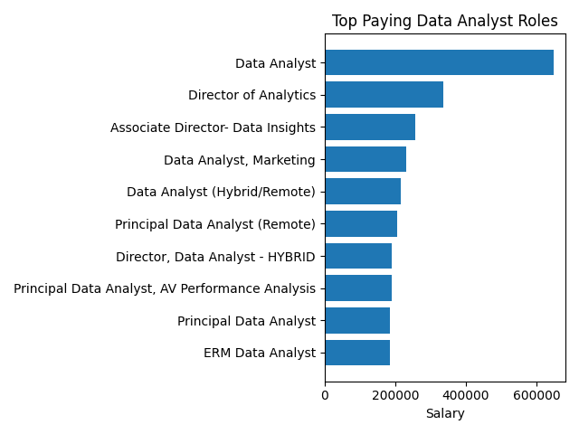
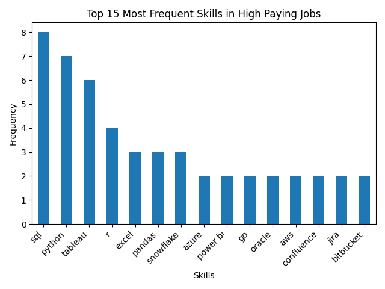
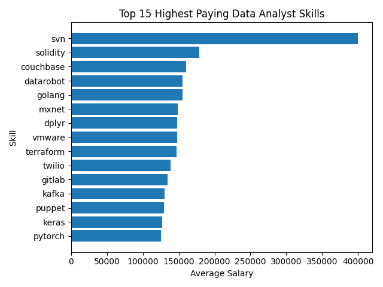
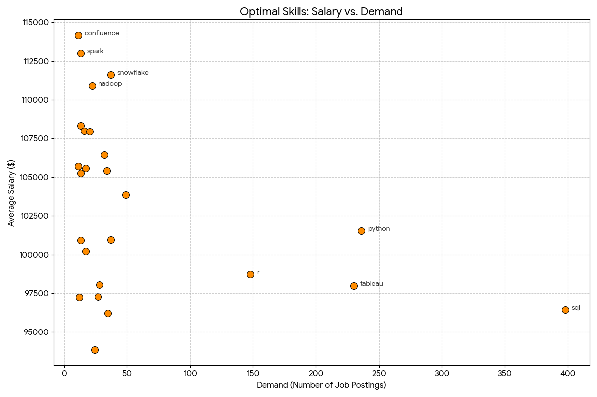

# Introduction
In this project, i dive into the job market, mainly focusing on data analyst roles.
This project explores 💰 top-paying jobs, 🔥 in-demand skills, and where 📈 high demand meets high salary in data analytics.

🕵️SQL queries? Check them out here: [project_sql](/project_sql/)

# Background
The project idea comes from a desire, as an upcoming data analyst, to be able to 🛣️navigate through the data science job market more effectively, to be able to pinpoint high-paying jobs and job skills related to data analysis that are the most demanded by employers.

The project itself can also serve as a ⚒️tool for other fellow 📊data science nerds who want to know which skills,jobs they should focus on.

The data is sourced from my mentor/teacher's Youtube SQL course [Luke Barousse's SQL Course](https://lukebarousse.com/sql)

### The questions that are answered by my queries are
1. What are the top-paying data analyst jobs?
2. What skills are required for these top-paying jobs?
3. What skills are most in demand for data analysis?
4. Which skills are associated with higher salaries?
5. What are the most optimal skills to learn?

# Tools used
During this SQL data exploration and analysis, I used the following tools:

- **SQL**: This is the most essential and fundamental tool and language that i used to query the database , to get insights and trends from the data 
- **PostgreSQL**: This is the database management system chosen to set-up and manage the database, ideal for handling the job posting data used in the analysis.
- **Visual Studio Code**: The tol used for database mnagement, executing queries.
- **Git & GitHub**: Essential for version control and sharing my SQL scripts and analysis, ensuring collaboration and project tracking.
# Analysis
Each query in this project is aimed at looking into specific aspects of the data analyst job market. Here's how I approached each question:

### 1. Top Paying Data Analyst Jobs
To identify the highest paying roles, I filtered data analyst positions by average yearly salary and location, focusing on remote jobs. This query highlights the high paying oppotunities in the field.

```sql
SELECT
    job_id,
    job_title,
    job_location,
    company_dim.name AS company_name,
    job_schedule_type,
    salary_year_avg,
    job_posted_date
FROM 
    job_postings_fact
LEFT JOIN company_dim ON job_postings_fact.company_id = company_dim.company_id
WHERE
    job_title_short = 'Data Analyst'
    AND job_location = 'Anywhere'
    AND salary_year_avg IS NOT NULL
ORDER BY
    salary_year_avg DESC
LIMIT 10;
```

Here's the breakdown of the top paying data analyst jobs in 2023:
- **Wide Salary Range** Top paying data analyst roles span from $184,000 to $650,000, indicating that ther is a significant salary potential in the field of data analysis
- **Diverse Employers** Companies like SMartAsset, Meta and AT&T are among the companies offering high salaries, showing a broad interest across different industries.
- **Job Title Variety** There's a lot of diversity in job titles related to data analysis, from simply Data Analyst to Director of Analytics, indicating varied roles and specializations.

 

*Bar Graph visualizing the salary for the top 10 salaries for data analysts; ChatGPT generated this graph from the SQL query results*

### 2. Top required skills for data analyst job positions
In this query, I dive deep intot the data to find out which skills are most requested for data analyst job positions, The data is filtered based on job posts that allow for remote work and also mention salary offerings.

``` sql
WITH top_paying_jobs AS (
    SELECT
        job_id,
        job_title,
        company_dim.name AS company_name,
        salary_year_avg
        
    FROM 
        job_postings_fact
    LEFT JOIN company_dim ON job_postings_fact.company_id = company_dim.company_id
    WHERE
        job_title_short = 'Data Analyst'
        AND job_location = 'Anywhere'
        AND salary_year_avg IS NOT NULL
    ORDER BY
        salary_year_avg DESC
    LIMIT 10

)
SELECT 
    top_paying_jobs.*,
    skills
FROM top_paying_jobs
INNER JOIN skills_job_dim ON top_paying_jobs.job_id = skills_job_dim.job_id
INNER JOIN skills_dim ON skills_job_dim.skill_id = skills_dim.skill_id
ORDER BY
    salary_year_avg DESC

```
Lets breakdown the top skills tied to remote data analysis jobs 
- **Data Skills Dominate** SQL and Python are clearly the most in-demand, This tells us that data manipulation and querying are core requirements for high-paying roles.These two alone form the backbone of high paying data analysis related jobs.
- **Visualization Tools Are Highly Valued** Tools like Tableau and Power BI rank high.This indicates companies don’t just want data—they want insights communicated clearly, the key insight is that being able to tell stories with data is just as important as analyzing it.
-  **Cloud & Data Platforms Are Rising** Skills like Azure, AWS, Snowflake appear frequently.This reflects a shift toward cloud-based data infrastructure.Modern high-paying jobs expect familiarity with cloud ecosystems, not just local tools.

 

*A visualization showing the most frequent skills associated with remote data analysis jobs*

### 3. Top 5 demanded skills in data analyst job posts
To find out the the top 5 skills with the highest demand in the job market in order to be able to provide isnight into the most valuable skills for job seekers, I filtered the data to just data analyst job posts, those that are remote and also limited to just the top 5 most demanded

```sql
SELECT 
    skills,
    COUNT(skills_job_dim.job_id) AS demand_count
FROM job_postings_fact
INNER JOIN skills_job_dim ON job_postings_fact.job_id = skills_job_dim.job_id
INNER JOIN skills_dim ON skills_job_dim.skill_id = skills_dim.skill_id
WHERE
    job_title_short = 'Data Analyst'
    AND job_work_from_home = TRUE
GROUP BY
  skills
ORDER BY
    demand_count DESC
LIMIT 5;
```

What insights did we gain from this analysis?
- **SQL is the absolute leader**: With a demand count of 7,291, SQL dominates the requirements. It is clear that database querying remains the foundational skill required for data analysts working in remote environments.

- **Excel and Python are head-to-head**: Excel remains highly relevant with 4,611 mentions, narrowly leading over Python with 4,330 mentions. This reflects that companies heavily value both programmatic analysis and traditional spreadsheet handling.

- **The Visualization Battle**: Tableau is in high demand with 3,745 mentions compared to Power BI's 2,609. Together, they account for 6,354 mentions, highlighting that visual reporting is another pillar of full-stack remote data analytics.

| Skills | Demand Count |
| :--- | :--- |
| SQL | 7,291 |
| Excel | 4,611 |
| Python | 4,330 |
| Tableau | 3,745 |
| Power BI | 2,609 |

### 4. Top paying skills based on average yearly salary
For this query, I looked at the average salary associated with each skill for Data Analysts, regardless of location in order to  show how different skills impact salary levels for Data Analysts and help identify the most financially rewarding skills to acquire.
```sql
SELECT 
    skills,
    ROUND (AVG(salary_year_avg), 0) AS average_salary
FROM job_postings_fact
INNER JOIN skills_job_dim ON job_postings_fact.job_id = skills_job_dim.job_id
INNER JOIN skills_dim ON skills_job_dim.skill_id = skills_dim.skill_id
WHERE
    job_title_short = 'Data Analyst'
    AND salary_year_avg IS NOT NULL
   --  AND job_work_from_home = TRUE
GROUP BY
  skills
ORDER BY
    average_salary DESC
LIMIT 25;
```

We can breakdown the following insights from this query:
- **🚨 Outlier Skill**: The skill “svn” at $400K is an outlier, as it is way above everything else.Likely reflects a very niche role, or a low sample size skewing the average
- **💰 Blockchain & Niche Tech Pay Premium** Solidity skills are at ($179K) standing out strongly likely Indicating demand for blockchain / Web3 skil, which also can mean that emerging tech = fewer experts = higher pay. 
- **☁️ Cloud & Infrastructure Skills Are Big Money**  Skills like:
1. Terraform
2. VMware
3. Kafka
4. Cassandra
5. Airflow
- These are data engineering / infrastructure tools, not traditional analyst tools, their prevalence and high pay in our result set shows that the  more you move toward data engineering, the higher the pay.

       
*Image generated by Google Gemini using a JSON data file from my query*

### 5. Optimal skills to elarn for data analysts(high paying and high demand)
To end this quest for knowledge, i use this query to find out skills that offer job security(High demand) and financial benefits (high salaries), in order to offer strategic insights for career development in data analysis.

```sql
WITH skills_demand AS(
    SELECT 
        skills_dim.skill_id,
        skills_dim.skills,
        COUNT(skills_job_dim.job_id) AS demand_count
    FROM job_postings_fact
    INNER JOIN skills_job_dim ON job_postings_fact.job_id = skills_job_dim.job_id
    INNER JOIN skills_dim ON skills_job_dim.skill_id = skills_dim.skill_id
    WHERE
        job_title_short = 'Data Analyst'
        AND salary_year_avg IS NOT NULL
        AND job_work_from_home = TRUE
    GROUP BY
    skills_dim.skill_id

    
    ), average_salary AS (
    SELECT 
        skills_job_dim.skill_id,
        ROUND (AVG(salary_year_avg), 0) AS avg_salary
    FROM job_postings_fact
    INNER JOIN skills_job_dim ON job_postings_fact.job_id = skills_job_dim.job_id
    INNER JOIN skills_dim ON skills_job_dim.skill_id = skills_dim.skill_id
    WHERE
        job_title_short = 'Data Analyst'
        AND salary_year_avg IS NOT NULL
    --  AND job_work_from_home = TRUE
    GROUP BY
    skills_job_dim.skill_id
  
     
)  


SELECT
    skills_demand.skill_id,
    skills_demand.skills,
    demand_count,
    avg_salary
FROM 
    skills_demand
INNER JOIN average_salary ON skills_demand.skill_id = average_salary.skill_id
WHERE 
    demand_count > 10
ORDER BY
    avg_salary DESC,
    demand_count DESC
    
LIMIT 25;
```

Through the use of multile CTEs, I discovered the following insights:
- **The Foundational Powerhouses (High Demand, Standard Salary)**
These skills are the "entry tickets" to the industry.`SQL (398 postings)`: By far the most demanded skill, but it has the lowest average salary ($96.4k) in this specific "optimal" group. This is because SQL is a base requirement for almost all roles, from entry-level to senior.`Python (236 postings) & Tableau (230 postings)`: These are the next most critical tools. Python commands a slightly higher "premium" ($101.5k) than Tableau ($97.9k).

- **The Specialized "Sweet Spot" (Moderate Demand, High Salary)**
If you are looking to maximize your ROI (Return on Investment) for learning time, these skills offer a high salary with decent job availability,`Snowflake ($111.5k)`: A standout performer. It has higher demand than other niche tools (37 postings) and sits near the top for salary.`Looker ($103.8k)`: With 49 postings, it is the most in-demand "high-paying" visualization tool, outperforming Tableau and Power BI in terms of average salary.`Cloud Platforms (AWS & Azure)`: Both sit comfortably above the $105k mark with consistent demand (32–34 postings).

- **The Niche High-Payers (Low Demand, Maximum Salary)**
These skills represent specialized technical niches like Big Data and Project Management.`Confluence ($114.1k)`: Surprisingly leads the list, likely reflecting senior analyst or "Lead" roles that require documentation and project management expertise.`Spark ($113k) & Hadoop ($110.8k)`: These "Big Data" skills command a high premium because the talent pool is smaller and the technical barrier to entry is higher.


*Image generated by Google Gemini using a JSON data file from my query*

# What I learned
- **Basic to Complex Query Crafting** I went from zero to hero in the query crafting department, learning the basics of queries(`SELECT,FROM,WHERE`) all the way up to the the complex `CTE, SUBQUERY,UNION` combo

- **Data Agregation** I became familiar with utilizing `GROUP BY, HAVNG` as well as aggregate functions such as `COUNT() AVG() MAX() MIN()`

- **Analytical Prowess** Through querying, asking questions and investigating the dataset , i was able to level up and improve my data analysis skills.
# Coclusions

### Insights 
1. **Top-paying Data Analyst Jobs** 
The highest paying jobs for data analysts that allow remote work ofer a wide range of salaries, the highest being $650,000!
2. **Skills for Top-Paying Jobs**
High-paying data analyst jobs reuire advanced profeciency in SQL, suggesting that it's a crital skill for earning a top salary in data analysis
3. **Most In-demand Skills**
SQL is also the most demanded skill in the data analyst job market, making it essential for job seekers.
4. **Skills with Higher Salaries**
Specialized skills, sucha as SVN and Solidity, are associated with higher salaries, indicating a premium on  niche expertise.
5. **Optimal Skills for Job Market Value**
SQL leads in demand and offers for a high average salary, positioning it as one of the most optimal skills for a data analyst to learn to maximise their market value.

### Closing Thoughts
Through the use of Luke Barousse's SQL bootcamp, i awas able to learn how to utilize the power and effeciency of **SQL**, learn how to set up a database on my computer and also run a database using **PostgreSQL**. I also revisited how to take all my findings and knowledge and share it with the world using Git and GitHub. In addition to that i acquired valuable skills in data querying, database management, dataset creation.Through learning this course, I can now say that i can use SQL to analyze large amounts of data more effeciently than i was able to do before. 